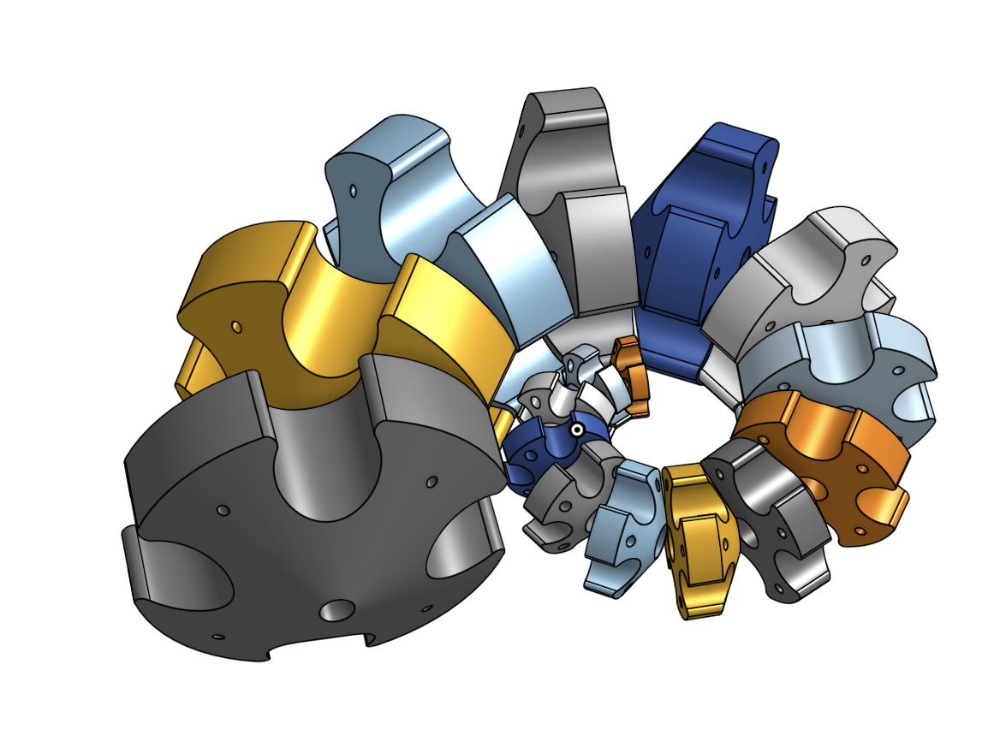
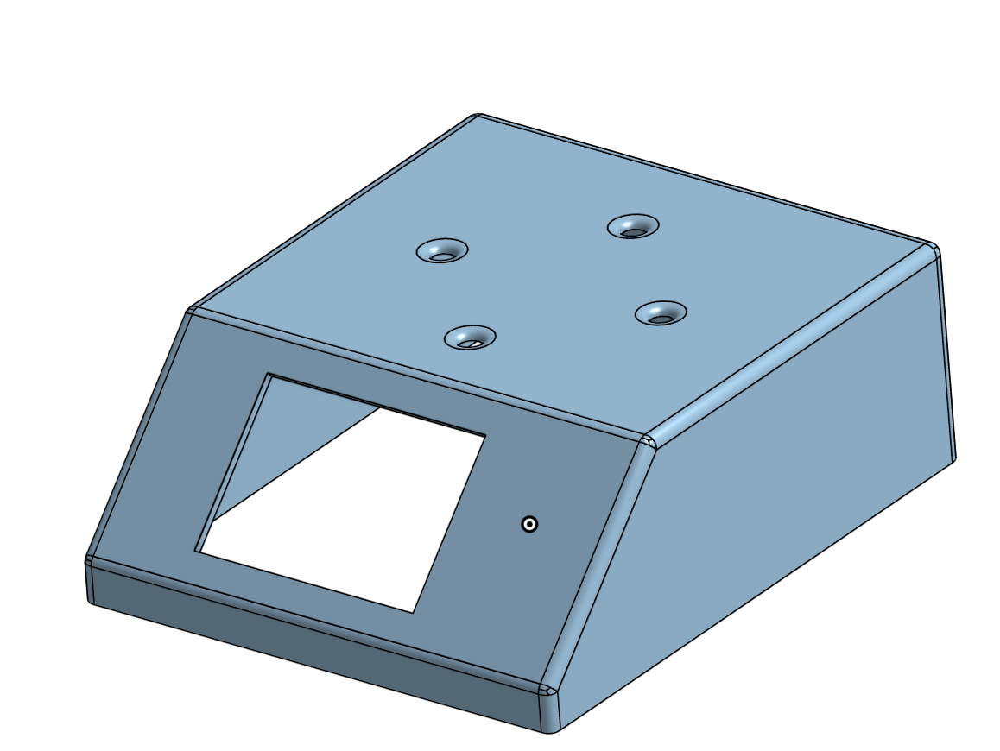
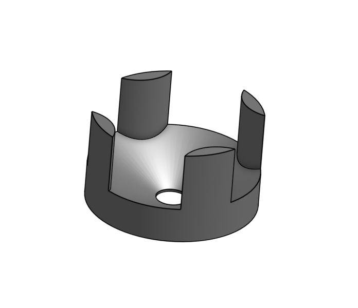
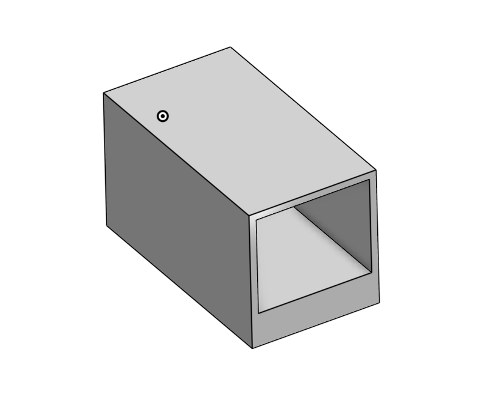
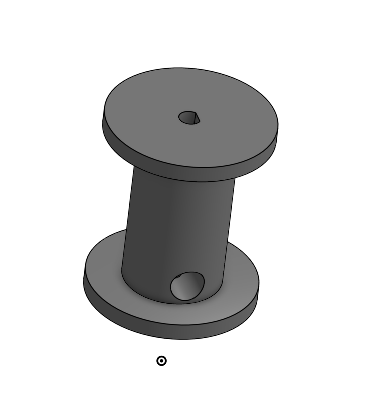

# Octocat Tentacle
We decided to create one of Mona's Octocat tentacles. This tentacle boasts a full 360-degree range of motion, utilizing a fibbinochi sequence and logarithmic spiral as a reference to craft the tentacle linkages. It achieves this with a 16-link tentacle, controlled by a 4-string motor system, ensuring full motion control. Using the logarithmic spiral as a reference, allowing the tentacle to be able to grab small objects, and have a full range of grabbing/wrapping.

## Materials/Properties
- 16 Main Tentacle Linkages
- 4 lines of fishing line
- 4 Gear Motors
- 4 Spools
- 1 Covering
- 4 Motor Casing

## Physical Tentacle

This shows the completed unpowered tentacle.

## 16 Main Tentacle Linkages

The formation of the logarithmic spiral in the tentacle uses sixteen linkages, each contributing to its overall curvature and flexibility. This arrangement allows the tentacle to curl fully into a flaccid position, closely resembling the natural resting state found in many organisms. This design effectively demonstrates how mathematical patterns can be used to mimic biological forms

## Covering

The covering holds the four motors, four spools, and the display in the front. This also works as a base for the tentacle.

## Stabilizing Support

This works as a support piece to be able to attach the linkages to the covering without it being permanently attached.

## Motor Casing

This is to hold the motors under the covering and be able to glue to the bottom side of the covering to be able to attatched to the spool to wind/unwind fishing line to enable movement into the tentacle.

## Spool

The spool, attached to the motor, holds the wound string and is the main point of contact of the fishing line from the linkages to the motor. The spool has a cylindrical offset hole, this is for wrapping the fishing line and for it not to fall off the spool if full unwinding takes place.

# (BOM)
## Components

| Component | Quantity |
|-----------|----------|
| Geared Motors | 4 | 
| Fishing Line | 1 | 
| Arduino Uno | 1 | 
| Motor controllers | 2 | 
| jumper wires | 24 |
| TFT display | 1 |
